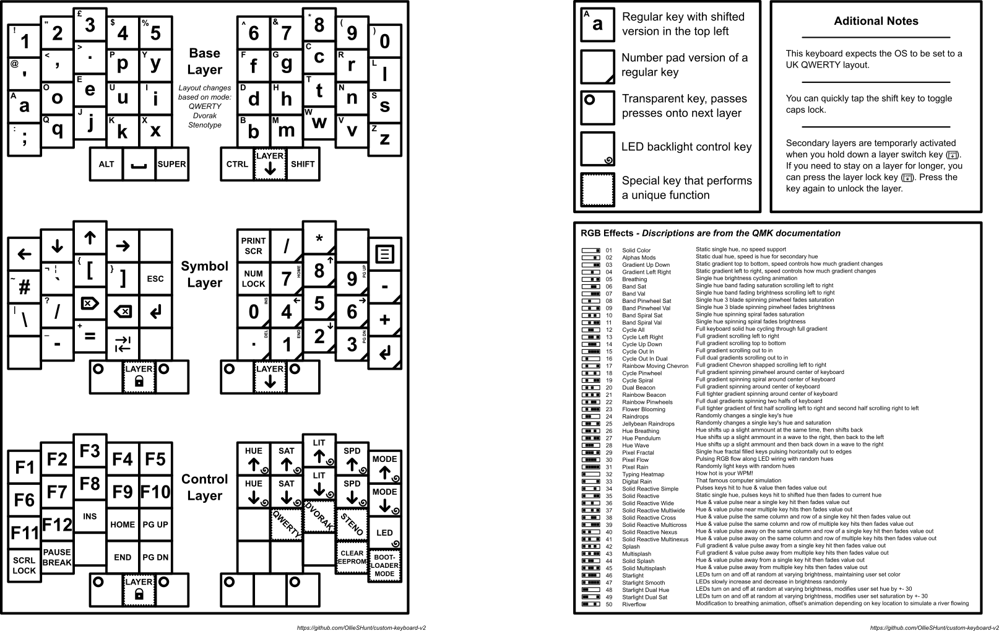

# Custom Keyboard V2
This repository contains KiCad design files for a home-made custom keyboard.

## Current State
***IMPORTANT***: Although the keymap reference sheet (`./keymap/keymap-exported.pdf`) mentions a "Stenotype mode", this is not yet implemented. The rest of the keyboard should be fully functioning though.

## Key Features
- Support for both QWERTY and Dvorak layouts
- Stenography support (**WIP**)
- 128x64 OLED display
  - WPM counter
  - Visual indicators for caps lock, num lock, and scroll lock, as well as layers
- RGB lighting with cool animations

## Repository Layout
- `./circit_board` = KiCad design files
- `./kicad-libs` = Third party libraries that KiCad can use
- `./keymap` = Reference sheet of this keyboard's layout (**NOTE**: `keymap-inkscape.svg` will only show both pages properly when opened with [Inkscape](https://inkscape.org). If you don't want to download Inkscape, please see `keymap-exported.pdf` instead)

## QMK Firmware
This repository just contains the KiCad design files. For the firmware, see [my fork of QMK](https://github.com/OllieSHunt/qmk_firmware).

**IMPORTANT**: Within the fork, the firmware for this keyboard will be located in `dev_branch`, **not** the default `master` branch and will be under the folder `keyboards/custom_keyboard_v2`.

Useful QMK links:
- https://docs.qmk.fm/newbs
- https://docs.qmk.fm/newbs_git_best_practices

## Components List
- Custom circuit board
- Raspberry Pi Pico 1 (without headers)
- SSD1306 based 128x64 OLED display (must be I2C compatible and run of 3V)
- 46 Gateron Low Profile Switch 2.0
- 46 Gateron compatible Low Profile Keycaps
- 46 1N4148W diodes
- 46 WS2812C-2020 LEDs
- Some stick-on silicone feet (I used 5mm tall ones)

## KiCad Libraries Used
- [MX_V2](https://github.com/ai03-2725/MX_V2/tree/main)
